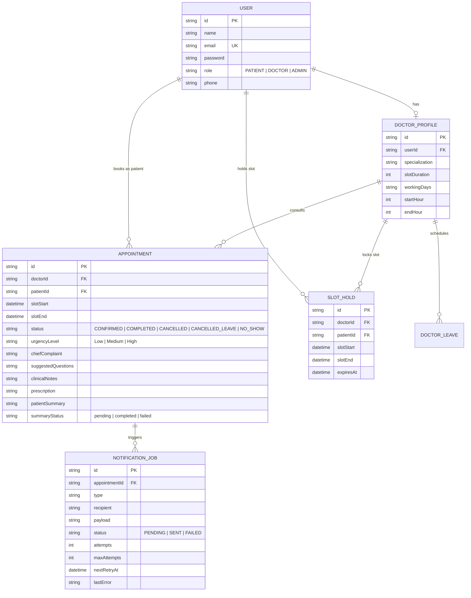

# CareLoop — AI-Powered Healthcare Appointment & Follow-up Manager
(Hosted link - https://careloop-app-rust.vercel.app)

> **CareLoop** is a production-ready healthcare management application designed for multi-specialty medical clinics. It bridges the gap between patient intake and doctor consultation using **Google Gemini 2.0 Flash** for structured pre-visit triage briefs and live-streamed post-visit summaries, backed by robust concurrency controls (slot-holds, DB-level unique constraints, transaction isolation), leave conflict resolution with one-click rebooking, and resilient notification retries via a `notification_jobs` background queue.

---

## 🌟 Key Highlights & Differentiators

1. **Urgency-Color-Coded Doctor Triage Queue**: Converts structured pre-visit JSON triage into an actionable clinical workflow (Red/Amber/Green badges with 3 diagnostic questions generated before the patient enters).
2. **5-Minute Slot Hold Lock with UI Countdown**: Synchronized locking mechanism that prevents race conditions while patients complete structured symptom intake.
3. **Double-Booking Prevention**: Database-level unique compound constraints `(doctorId, slotStart)` and atomic Prisma transactions returning clean HTTP 409 responses under concurrent load.
4. **Live-Streamed AI Patient Summaries**: Token-by-token streaming of clinical notes into plain-language summaries and prescription schedules with automatic fallback on API outage.
5. **Doctor Leave Conflict Resolution & 1-Click Rebook**: Automatic batch cancellation of affected appointments (`CANCELLED_LEAVE`) and patient notification with a direct 1-click rebooking portal.
6. **Resilient Notification Queue**: Zero silent drops — all email and Google Calendar synchronization jobs write to a dedicated DB queue with exponential backoff retries (up to 3 attempts) and admin error inspection.

---

## 🚀 Quick Start (Local Development)

CareLoop works **out of the box** with local SQLite and mock AI/notification fallbacks. No external API keys are required to test the application locally!

### 1. Clone & Install Dependencies
```bash
git clone https://github.com/your-username/careloop.git
cd careloop
npm install
```

### 2. Configure Environment Variables
Copy `.env.example` to `.env`:
```bash
cp .env.example .env
```

### 3. Initialize Database & Seed Demo Data
```bash
npm run db:push
npm run db:seed
```

### 4. Start Development Server
```bash
npm run dev
```
Open [http://localhost:3000](http://localhost:3000) in your browser.

---

## 👥 Demo Test Accounts (Pre-Seeded)

You can log in manually or use the **1-Click Persona Switcher** directly on the landing page:

| Role | Email | Password | Details |
| :--- | :--- | :--- | :--- |
| **👑 Admin** | `admin@careloop.local` | `AdminPass123!` | Ops dashboard, doctor roster, notification queue |
| **🩺 Doctor 1** | `dr.smith@careloop.local` | `DoctorPass123!` | Cardiology (High Urgency Triage & Live AI Streaming) |
| **🩺 Doctor 2** | `dr.patel@careloop.local` | `DoctorPass123!` | Dermatology (Schedule & Leave Management) |
| **👤 Patient** | `patient.jane@careloop.local` | `PatientPass123!` | Slot hold booking, symptom intake, AI summaries |

---

## 🐳 Docker Compose Setup (PostgreSQL + App)

To run a production-like environment with PostgreSQL locally:

```bash
docker compose up --build
```
The application will be accessible at `http://localhost:3000` connected to a local PostgreSQL 16 container.

---

## 🗄️ Database Schema Diagram



---

## 🧠 Exact AI / LLM Prompts (`/src/lib/prompts.ts`)

### 1. Pre-Visit Triage Prompt (Strict JSON Output)
```text
You are a clinical triage AI assistant for CareLoop.
Analyse these symptoms and return urgency level (Low/Medium/High), chief complaint, and three suggested questions for the doctor.

Symptoms:
Duration: {duration}
Pain/Severity Scale (1-10): {severity}/10
Reported Symptoms/Tags: {tags}
Patient Description: {notes}

Return a valid JSON object matching this exact schema:
{
  "urgencyLevel": "Low" | "Medium" | "High",
  "chiefComplaint": "A concise 1-2 sentence clinical summary of the primary complaint and onset.",
  "suggestedQuestions": [
    "Question 1 for doctor to ask regarding symptoms",
    "Question 2 for doctor to evaluate differential diagnosis",
    "Question 3 for doctor to check red flags or lifestyle factors"
  ]
}
```

### 2. Post-Visit Patient-Friendly Summary Prompt (Live Streamed)
```text
You are CareLoop's patient communication medical AI.
Convert these clinical notes into a patient-friendly summary with a medication schedule and follow-up steps.

Doctor's Clinical Notes:
{clinicalNotes}

Prescription & Orders:
{prescription}

Formatting Guidelines:
1. Use warm, reassuring, and easy-to-understand plain language (grade 6-8 reading level).
2. Clearly divide the response into 3 sections with Markdown headers:
   - ## 📋 Visit Summary & Diagnosis (What we discussed in simple terms)
   - ## 💊 Medication & Care Schedule (Clear daily instructions, dosage, and when to take)
   - ## 🗓️ Next Steps & When to Seek Urgent Care (Follow-up timing, warning signs)
3. Keep it clear, concise, and structured.
```

---

## 🌐 Google Calendar OAuth Setup Steps

1. Go to [Google Cloud Console](https://console.cloud.google.com/) and create a project named `CareLoop`.
2. Navigate to **APIs & Services > Library** and enable **Google Calendar API**.
3. Go to **APIs & Services > Credentials** and click **Create Credentials > OAuth client ID**.
4. Set Application Type to **Web Application**.
5. Add Authorized Redirect URI:
   `http://localhost:3000/api/auth/callback/google` (and your production domain callback).
6. Copy the **Client ID** and **Client Secret** into your `.env`:
   ```env
   GOOGLE_CLIENT_ID="your-google-client-id"
   GOOGLE_CLIENT_SECRET="your-google-client-secret"
   GOOGLE_REDIRECT_URI="http://localhost:3000/api/auth/callback/google"
   ```

---

## 📡 API Endpoints Documentation

| Method | Endpoint | Description |
| :--- | :--- | :--- |
| `GET` | `/api/health` | Healthcheck (200 OK + DB connectivity & latency) |
| `GET` | `/api/slots/available` | Available slots calculation (considers hours, leaves, appointments, holds) |
| `POST` | `/api/slots/hold` | Acquire atomic 5-minute slot hold |
| `DELETE` | `/api/slots/hold` | Release active slot hold |
| `GET` | `/api/appointments` | List role-isolated appointments |
| `POST` | `/api/appointments` | Book appointment with transactional double-booking prevention |
| `GET` | `/api/appointments/:id` | Fetch appointment details & triage data |
| `PATCH` | `/api/appointments/:id` | Update clinical notes, prescription, and finalize consultation |
| `POST` | `/api/ai/pre-visit` | Trigger Gemini pre-visit JSON triage extraction |
| `POST` | `/api/ai/post-visit` | Live stream patient-friendly summary tokens |
| `GET` | `/api/doctor/leave` | List doctor leave periods |
| `POST` | `/api/doctor/leave` | Register leave, cancel affected slots, & dispatch rebooking links |
| `GET/POST` | `/api/cron/process-jobs` | Vercel Cron worker for notification retries & expired hold sweeps |
| `GET` | `/api/admin/metrics` | Operations KPIs (cancellation rate, no-show rate, failed jobs) |
| `GET/POST` | `/api/admin/doctors` | List and create doctor profiles |
| `GET/POST` | `/api/admin/notifications` | Inspect notification queue and trigger manual retries |

---

## 🚀 Deployment to Vercel & Railway

1. **Database**: Create a PostgreSQL database on [Railway](https://railway.app/) and copy the connection string.
2. **Vercel Deployment**:
   - Push repository to GitHub.
   - Import project to Vercel.
   - Configure Environment Variables in Vercel project settings (`DATABASE_URL`, `NEXTAUTH_SECRET`, `GEMINI_API_KEY`, `RESEND_API_KEY`).
   - Run `npx prisma db push && npm run db:seed` or connect to Railway Postgres.
3. **Cron Jobs**: Vercel Cron is configured to trigger `/api/cron/process-jobs` every 15 minutes.

---

## 📄 System Design & Concurrency Deep-Dive

For an in-depth architectural breakdown covering double-booking race condition prevention, 5-minute slot hold locks, doctor leave cascading, and exponential backoff notification queues, see:
[`/docs/system-design.md`](./docs/system-design.md)
